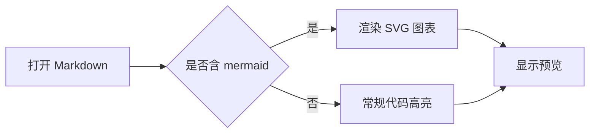

# md-preview

一个小型本地 Markdown 预览桌面应用，使用 Go + Wails + React + Tailwind 构建。

项目核心目标是：给本地文件提供稳定、干净且可重复的 Markdown 渲染体验，直接在独立窗口中查看，避免启动浏览器或暴露额外服务。

## 功能特性

- **Markdown 渲染**：goldmark + GFM（表格、任务列表、删除线等），经 bluemonday 安全过滤
- **Mermaid 图表**：支持 ` ```mermaid ` 代码块渲染为 SVG 流程图、时序图、类图、状态图、甘特图、饼图等，跟随主题切换调色板，导出 HTML 同样可渲染
- **脚注渲染**：支持 `[^note]` 与 `[^note]: ...` 形式的 Markdown 脚注
- **Wiki 链接**：支持 `[[页面名]]`、`[[文件.pdf]]` 和 `[[页面|显示文本]]` 语法的双向链接
- **Frontmatter 渲染**：自动解析 YAML frontmatter，以 GitHub 风格属性表展示，支持嵌套对象、数组标签、链接识别，跟随主题适配
- **语法高亮**：Prism.js 支持 14 种编程语言，带行号显示和代码块复制按钮
- **文件监听**：1 秒轮询，文件变更自动刷新预览
- **目录导航**：自动提取标题生成 TOC 侧边栏，点击跳转
- **三套主题**：Light / Dark / Sepia，选择持久化存储
- **拖放支持**：直接拖入 `.md` 文件即可切换预览
- **导出 HTML**：导出带内联样式的独立 HTML 文件，支持主题选择
- **自动更新**：启动时默认检查正式发布版本并自动准备可用更新，可在菜单中关闭或手动检查
- **选中即复制**：鼠标左键选中正文文字，松开后自动复制到系统剪贴板
- **干净打印**：打印 PDF 时自动隐藏界面 chrome（菜单、目录、状态栏），移除面板装饰

## 脚注示例

下面这段就是实际渲染案例，正文里的脚注标记会显示为编号，脚注内容会集中显示在文末。

部分村庄母语保持相对较好；杂居村则更多处在汉语环境包围之中，日常表达、公共交往和新事物命名更容易转向汉语。[^FN-WEI-WENXIAN-BAIMA-2019]

[^FN-WEI-WENXIAN-BAIMA-2019]: 魏文贤：《白马藏族语言使用现状调查》，2019。

对应的 Markdown 源码写法如下：

```markdown
部分村庄母语保持相对较好；杂居村则更多处在汉语环境包围之中，日常表达、公共交往和新事物命名更容易转向汉语。[^FN-WEI-WENXIAN-BAIMA-2019]

[^FN-WEI-WENXIAN-BAIMA-2019]: 魏文贤：《白马藏族语言使用现状调查》，2019。
```

## Wiki 链接示例

Wiki 链接是 Obsidian 等笔记工具常用的双向链接语法。md-preview 支持三种写法：

- `[[Foo Bar]]` → 渲染为链接到 `Foo Bar.html` 的超链接，显示文本为"Foo Bar"
- `[[baz.pdf]]` → 已有扩展名时保持原样，链接到 `baz.pdf`
- `[[Image|display text]]` → 管道符后为显示文本，链接到 `Image.html`，显示"display text"

点击 Wiki 链接会自动在同目录下查找对应的 `.md` 文件并加载预览，支持中文文件名、带空格文件名以及 URL 编码的链接目标。导航后可用 `Alt+←` 返回，`Alt+→` 前进，与浏览器一致。

下面是实际渲染案例：

这是一个普通 wiki 链接 [[Wiki-Demo]]，带别名的链接 [[Wiki-Demo|点击跳转演示页]]。

对应的 Markdown 源码写法如下：

```markdown
这是一个普通 wiki 链接 [[Wiki-Demo]]，带别名的链接 [[Wiki-Demo|点击跳转演示页]]。
```

## Mermaid 图表示例

md-preview 支持 Mermaid 图表语法，把 ` ```mermaid ` 代码块直接渲染为 SVG 图表，常见类型包括 flowchart、sequence、class、state、gantt、pie 等。图表会跟随当前主题切换调色板，导出 HTML 时也会通过 CDN 脚本渲染。

下面是实际渲染案例：



对应的 Markdown 源码写法如下：

````markdown

````

## 键盘快捷键

| 快捷键 | 功能 |
|--------|------|
| `Ctrl+O` | 打开 Markdown 文件 |
| `Ctrl+S` | 导出 HTML |
| `Ctrl+P` | 打印 / 导出 PDF |
| `Ctrl+T` | 显示 / 隐藏目录导航 |
| `Alt+←` | 返回上一个文档（Wiki 链接导航） |
| `Alt+→` | 前进到下一个文档（Wiki 链接导航） |
| `F11` | 全屏 / 退出全屏 |

## 安装与运行

### 自动更新

md-preview 启动时默认检查 GitHub Releases 中的最新正式版本。检查在后台运行，不会阻塞 Markdown 预览加载。

在右上角 `Menu` 的 `Updates` 区域可以：

- 打开或关闭 `Auto Updates`，设置会在重启后保留。
- 点击 `Check Updates` 手动检查版本，即使自动更新已关闭也可以使用。
- 当更新已下载并准备好时，点击 `Restart to Install` 完成替换并重启应用。

如果网络不可用、没有兼容当前系统的发布资产，或当前不是正式发布构建，应用会显示非阻塞状态信息，当前预览功能仍可继续使用。

### 直接运行源码

```bash
go run . <file.md>
```

### 发布版本方式

```bash
wails build
.\build\bin\md-preview.exe <file.md>
```

## 命令参数

```text
Usage: md-preview [--browser] [--watch=false] <file.md>
```

- `--watch=false`  
  关闭文件监听。对于自动化脚本或单次检查更友好。
- `--browser`  
  保留兼容参数，当前仍以桌面模式启动。

## 给 Agent 的调用建议

如果你在自动化流程里调用该工具，建议按如下约定使用：

- 入口始终是单文件路径，例如：
  - `md-preview notes.md`
  - `md-preview --watch=false notes.md`
- 只要解析路径合法并成功启动预览，进程会持续运行直到窗口关闭；若参数或文件异常则快速返回非零退出码并输出错误。
- 当需要”可重复行为”时，优先使用 `--watch=false`。
- 不需要关注前端开发环境端口、浏览器地址或本地 HTTP 服务。

### 常见错误

- `file does not exist`：文件路径不存在或权限不足。
- `expected a Markdown file, got directory`：传入的是目录而非文件。
- `unsupported file extension`：请使用 `.md` 或 `.markdown`。

## 开发

```bash
wails dev
```

前端依赖与构建：

```bash
cd frontend
npm install
npm run build
```

## 版本发布

通过 Git tag 触发 GitHub Actions 自动化构建三平台二进制包：

```bash
git tag v0.0.1
git push origin v0.0.1
```

构建产物（Windows x64 .exe / macOS Intel & Apple Silicon / Linux x64）自动附到 GitHub Release。

## 许可

MIT 或 Apache 2.0（二选一可自行补充到发布说明）
