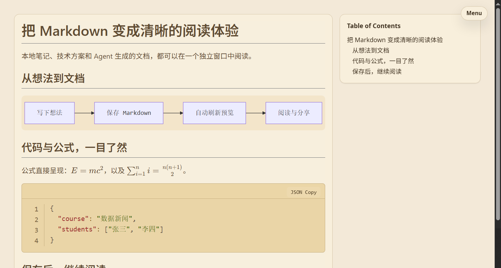

# md-preview

**一个窗口，清晰阅读本地 Markdown。**

A standalone Markdown viewer for Windows, macOS, and Linux, with live reload, Mermaid diagrams, KaTeX math, and Wiki links.

[下载最新版](https://github.com/yangjh-xbmu/md-preview/releases/latest) · [快速开始](#快速开始) · [Agent 使用场景](#让-agent-写文档随时查看预览) · [语法示例](docs/examples/syntax.md) · [反馈问题](https://github.com/yangjh-xbmu/md-preview/issues)



打开笔记、README、课程讲义或技术方案，在独立桌面窗口中阅读。支持 Windows、macOS 和 Linux，文件保存后自动刷新。

## 下载

前往 [最新 Release](https://github.com/yangjh-xbmu/md-preview/releases/latest)，按系统下载并解压对应文件。

| 系统 | 下载文件名 | 解压后打开 |
| --- | --- | --- |
| Windows x64 | `md-preview-v版本号-windows-amd64.zip` | `md-preview.exe` |
| macOS Apple Silicon | `md-preview-v版本号-darwin-arm64.tar.gz` | `md-preview.app` |
| macOS Intel | `md-preview-v版本号-darwin-amd64.tar.gz` | `md-preview.app` |
| Linux x64 | `md-preview-v版本号-linux-amd64.tar.gz` | `md-preview` |

Linux 需要 GTK 3 与 WebKitGTK 4.0 运行库。macOS 发布包尚未经过 Apple 公证，首次打开可能需要在系统安全设置中允许运行。

## 快速开始

1. 下载并解压适合当前系统的发布包。
2. 打开应用，点击 **Open File**，或将 `.md` / `.markdown` 文件拖入窗口。
3. 在自己的编辑器中修改文件并保存，预览会自动刷新。

也可以从终端指定文件。Windows 在解压目录中运行：

```powershell
.\md-preview.exe "D:\notes\plan.md"
```

macOS 在解压目录中运行：

```bash
open ./md-preview.app --args "$PWD/plan.md"
```

Linux 在解压目录中运行：

```bash
./md-preview ./plan.md
```

想先看看效果？下载或克隆本仓库，打开 [预览样例](docs/examples/preview.md)。

## 功能特性

| 阅读内容 | 支持的体验 |
| --- | --- |
| 日常 Markdown | GFM 表格、任务列表、删除线，目录导航与脚注 |
| 技术文档 | Mermaid 图表、14 种语言的代码高亮、行号与代码复制 |
| 课程与研究笔记 | KaTeX 行内和块级公式、YAML frontmatter 属性表 |
| 本地资料 | 相对路径图片、Wiki 链接导航、前进与返回 |
| 持续阅读 | 保存后自动刷新，Light / Dark / Sepia 三套主题，全屏 |
| 分享与输出 | HTML 导出、打印 / PDF 输出、选中文字自动复制 |

Markdown HTML 经过安全过滤。支持 PNG、JPEG、GIF、WebP 和 SVG 本地图片；HTTP、HTTPS 与邮件链接交给系统默认应用打开。

### Wiki 链接支持范围

支持 `[[页面名]]`、`[[目录/页面名]]` 和 `[[页面名|显示文本]]`。点击后按当前目录、Vault / Git 工作区根目录、文件名或路径后缀查找 Markdown 文件。

跨目录搜索需要祖先目录中存在 `.obsidian` 或 `.git`。同名笔记建议写完整路径。此功能提供笔记间导航，不提供反向链接索引、PDF 阅读或 Obsidian 插件运行能力。

### 本地阅读与联网行为

本地 Markdown 的正文、公式和图表在桌面应用内渲染。启动时默认后台检查更新，可以在 **Menu → Updates → Auto Updates** 中关闭。文档中的远程资源可能访问网络；导出 HTML 中的 Mermaid 图表通过 CDN 加载并渲染。

## 让 Agent 写文档，随时查看预览

让编程 Agent 将方案、报告或说明写入本地 Markdown，打开一次预览窗口，后续保存会自动刷新。AI 内容由你使用的 Agent 生成，md-preview 负责显示文件。


将程序加入 `PATH` 后，一条命令即可打开：

```bash
md-preview ./plan.md
```

可以把以下约定加入项目的 Agent 指令：

```text
将需要我阅读的方案保存为 Markdown。
首次生成后，用 md-preview 的绝对路径打开该文件，并让进程独立于终端持续运行。
后续修改同一文件并保存，由已有窗口自动刷新。
确认窗口中的正文已显示后，再报告预览完成。
```

调用示例、Windows 后台启动方式和参数限制见 [Agent 调用指南](docs/agent-usage.md)。

## 键盘快捷键

| 快捷键 | 功能 |
| --- | --- |
| `Ctrl+O` | 打开 Markdown 文件 |
| `Ctrl+S` | 导出 HTML |
| `Ctrl+P` | 打印 / 导出 PDF |
| `Ctrl+T` | 显示 / 隐藏目录导航 |
| `Alt+←` / `Alt+→` | 返回 / 前进（Wiki 链接导航） |
| `F11` / `Option+F11` | 全屏 / 退出全屏 |
| `Ctrl+Q` | 退出应用 |

## 更新与反馈

正式发布版本支持后台检查更新。在 **Menu → Updates** 中，可以手动检查更新、关闭自动更新，或在下载完成后点击 **Restart to Install**。源码开发构建不支持自动更新。

遇到问题，请[提交 Issue](https://github.com/yangjh-xbmu/md-preview/issues)，附上系统、应用版本、复现步骤和最小 Markdown 示例。分享前请移除文档中的私人信息。

## 开发

使用 Go、Wails、React 和 Tailwind 构建。Markdown 渲染基于 goldmark，HTML 清理使用 bluemonday。

需要 Go、Node.js 和 Wails CLI，以及对应平台的 Wails 构建依赖。仓库发布流程使用 Go 1.24.4、Node.js 20 和 Wails 2.12.0。

```bash
npm --prefix frontend ci
wails dev
```

构建与测试：

```bash
npm --prefix frontend run build
go test ./...
wails build
```

构建产物位于 `build/bin/`。开发细节与浏览器回归命令见 [CLAUDE.md](CLAUDE.md)。推送 `vX.Y.Z` 格式的标签会触发三平台构建，并将四个发布包上传到 GitHub Releases。

## 许可

项目许可证待维护者确定。第三方依赖遵循各自的许可证。
