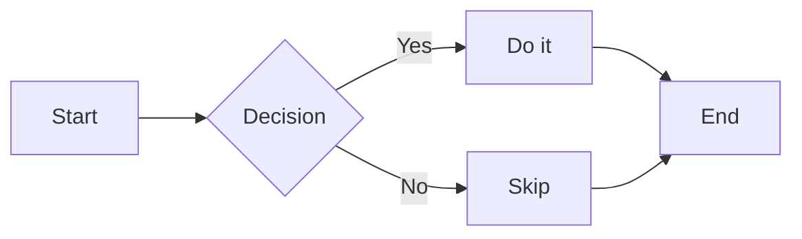

# Quickstart: Mermaid Rendering Support

## Prerequisites

- Run commands from the repository root.
- Ensure `frontend/node_modules` is installed (`npm --prefix frontend install`).

## Sample Markdown for Manual Verification

Create a temporary file `specs/002-mermaid-support/sample.md` with the following content (do not commit it):

````markdown
# Mermaid Sample



```go
package main
func main() {}
```
````

## Validation

Run the unit tests and frontend build:

```bash
go test ./...
npm --prefix frontend install
npm --prefix frontend run build
```

Expected result: all commands complete successfully.

Run the full desktop build:

```bash
wails build
```

Expected result: `build/bin/md-preview.exe` is rebuilt.

Manual smoke test:

```bash
wails dev
```

Open `specs/002-mermaid-support/sample.md` in the running app. Expected observations:

1. The Mermaid block renders as an inline SVG flowchart, not as raw code.
2. The Go block still has Prism highlighting, line numbers, and the copy button.
3. Switching theme from light to dark re-renders the flowchart with a dark palette.
4. Switching to sepia keeps the diagram readable on the warm background.
5. Exporting HTML via `Ctrl+S` and opening the exported file in a browser renders the Mermaid block as SVG.
6. Adding a syntax error to the Mermaid block and saving shows an in-page error placeholder, not a crash.
