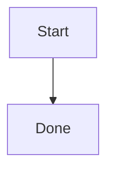

# Quickstart: Code Block Rendering Regression

## Prerequisites

- Go 1.23 available
- Node dependencies installed with `npm --prefix frontend install`
- Wails CLI available on PATH
- Temporary `jq` may be needed only for Spec Kit shell hooks on Windows Git Bash

## Validation Commands

Run from the repository root:

```bash
go test ./...
npm --prefix frontend run build
wails build
```

## Manual Smoke File

Create or use a Markdown document with:

```markdown
# Smoke

Code:

```yaml
proxies:
  - name: "usa-38.244.42.215"
    type: vmess
    server: 38.244.42.215
    port: 443
    udp: true
```

Footnote reference.[^note]

[^note]: Footnote content.


```

## Expected Results

- YAML code text and line numbers have no visual shadow in Light, Dark, and Sepia themes.
- Footnote reference links to the footnote section and the backlink works.
- Mermaid renders as a diagram and is not decorated as a normal code block.
- Exported HTML preserves footnote styles and no-shadow code block styles.

## Fresh Binary Preview

After `wails build`, launch:

```bash
build/bin/md-preview.exe README.md
```

The binary timestamp must be newer than the implementation commit. Do not use an older `build/bin/md-preview.exe` for final visual validation.
